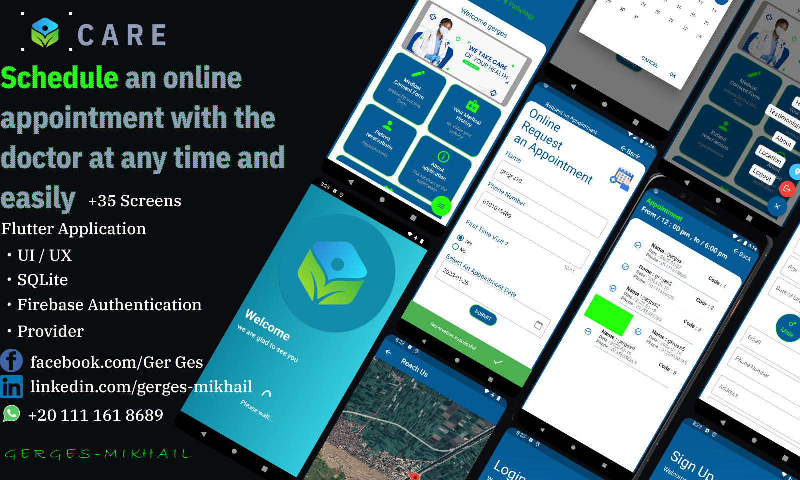

# Care-App
-------------
#### Design Credit : By  [Gerges Mikhail](https://www.linkedin.com/in/gerges-mikhail-8578661ba/)
-------------
#### This application can be used for private doctors' clinics or centers specialized in collecting information about patients.
-------------  
## Screenshots 

